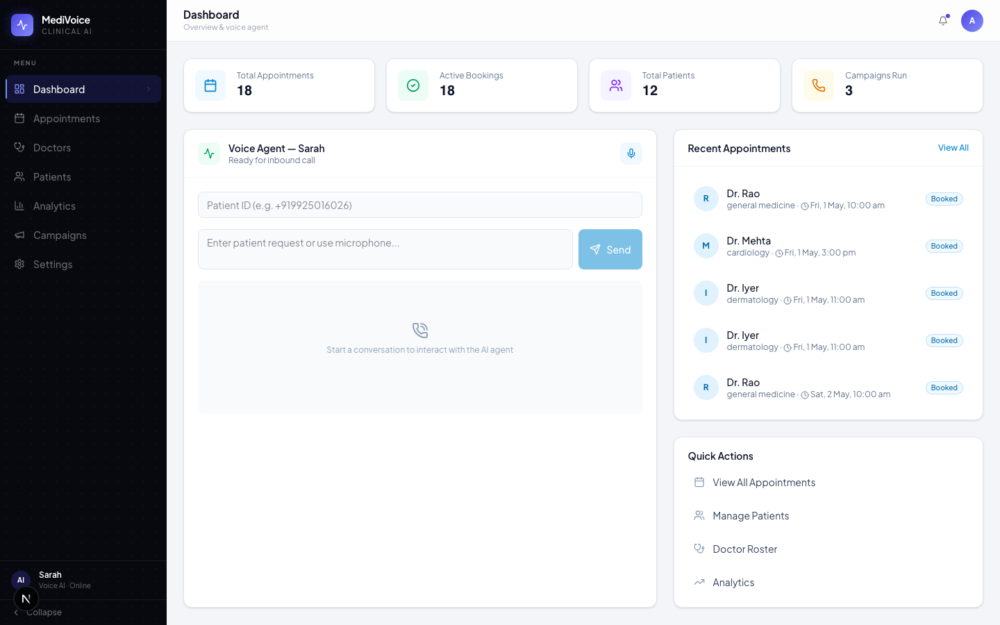
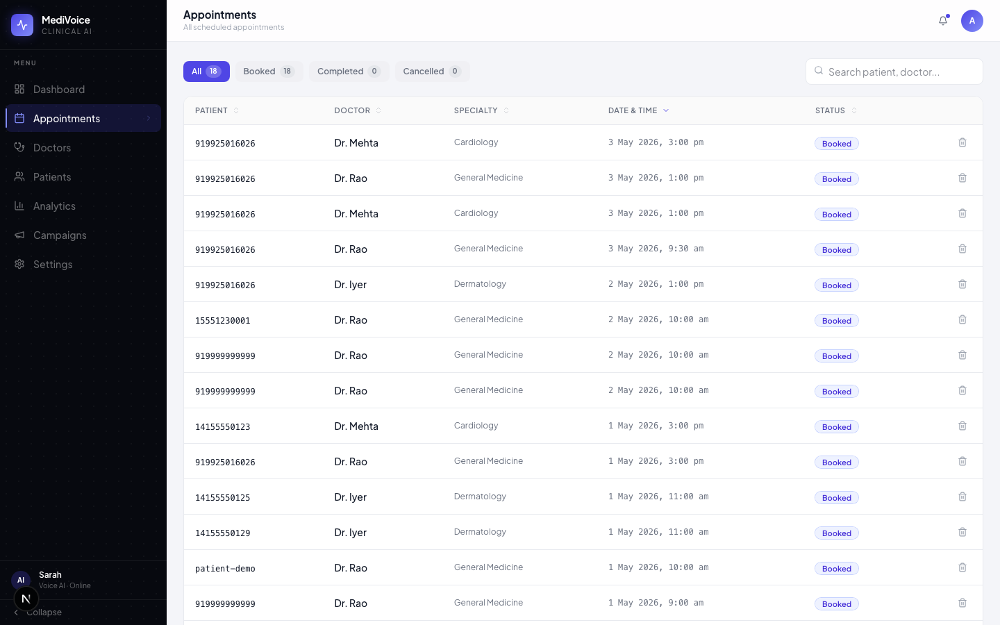
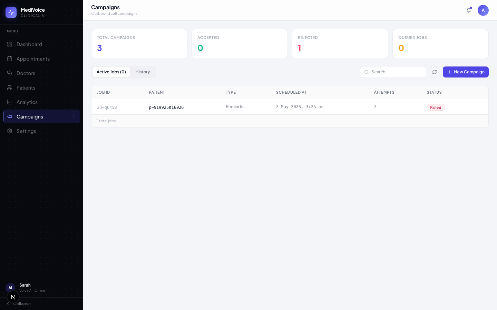

# MediVoice

> Real-time multilingual voice AI agent for clinical appointment scheduling, reminders, and front-desk automation.

MediVoice connects a patient phone call directly to a structured clinical action — booking, rescheduling, cancellation, and conflict resolution — across English, Hindi, and Tamil, with no human in the loop.

---

## Live Deployment

| Service | URL |
|---------|-----|
| Backend API | `https://medivoice-api-supabase.onrender.com` |
| Dashboard | `https://dashboard-his-projects-e8fc753c.vercel.app` |
| Health check | `GET /api/health` |

---

## Screenshots

<p align="center">
  
</p>

<p align="center">
  
  
</p>

---

## Quick Start (Local)

```bash
npm install
cp .env.example .env   # fill in SUPABASE_URL, SUPABASE_SERVICE_ROLE_KEY, VAPI_PRIVATE_KEY, VAPI_ASSISTANT_ID, VAPI_PHONE_NUMBER_ID
npm run dev
```

Open `http://localhost:5173` for the browser client, `http://localhost:8787` for the raw API.

For a production-style local build:

```bash
npm run build
npm start
```

### Vapi + Supabase Setup

1. Run `supabase-schema.sql` in the Supabase SQL editor, then verify with `npm run supabase:verify`.
2. Expose the API with `ngrok http 8787` or set `PUBLIC_SERVER_URL` to your public HTTPS URL.
3. Run `npm run vapi:setup` to create or update the Vapi tool, assistant, and phone routing.
4. Call the configured Vapi number — Vapi routes all tool calls to `/api/vapi/webhook`.

`GET /api/vapi/config` returns the webhook and tool URLs the setup uses.

### Try It

```
Book an appointment with Dr. Rao tomorrow at 10 am
Reschedule my appointment to tomorrow at 3 pm
When is my appointment?
Cancel my appointment
मुझे doctor appointment chahiye tomorrow 11 am
நாளை 10 மணிக்கு doctor appointment வேண்டும்
```

---

## Architecture

See [`docs/architecture.mmd`](docs/architecture.mmd) for the live Mermaid source.

```
Patient call
  └─► Vapi (phone number + GPT-4o LLM)
        ├─► assistant-request  ─► Express /api/vapi/webhook  ─► VoiceAgent
        └─► tool-calls         ─► Express /api/vapi/webhook  ─► VoiceAgent
                                                                    ├─► Language detector
                                                                    ├─► Intent + slot parser
                                                                    ├─► Scheduling tools
                                                                    └─► Supabase (patients · sessions · appointments · campaign_logs)

Outbound campaigns
  └─► CampaignScheduler (background in-process poller)
        └─► Vapi createCall API  ─► same webhook path above

Dashboard (Vercel / Next.js)
  └─► REST /api/* (proxied to Render backend)
        └─► patients · appointments · analytics · campaigns
```

---

## Architectural Decisions

### 1. Vapi as the voice transport layer

Vapi handles all telephony, STT (Deepgram nova-2), TTS (Vapi Clara voice), and the LLM turn loop (GPT-4o). Our backend is exposed only as a **server-side tool** via webhook. This means:

- We never deal with audio codecs, WebRTC, or real-time streaming — Vapi handles all of that.
- Every patient utterance arrives as clean text to `/api/vapi/webhook` via a `tool-calls` event.
- The LLM (GPT-4o) is instructed to call `processTurn` for **every utterance without exception**, including confirmations ("yes", "no"). This makes the backend the single source of truth for all scheduling logic.

The tradeoff is an extra round-trip through Vapi's LLM on every turn. This adds ~100–200 ms to the hot path but eliminates the need to manage our own voice pipeline.

### 2. Tool-first orchestration, not prompt-first

All scheduling logic lives in the TypeScript backend, not in the LLM prompt. The LLM is a thin router: its only jobs are transcription → `processTurn(utterance)` → speak result. This means:

- **Deterministic outcomes**: the same utterance always produces the same action.
- **Testable without a phone**: all scheduling logic can be exercised via `POST /api/voice-turn`.
- **No prompt injection risk**: the LLM never constructs slot values — it only passes raw utterances.

### 3. Multi-step gathering state machine

Booking requires three pieces of information: doctor, time, and patient name. Rather than asking for all three in a single prompt, `VoiceAgent` drives a **step-by-step gathering flow** (`gatheringBook: { step: 'doctor' | 'time' | 'name' }`) persisted to Supabase between turns. This lets the agent recover mid-conversation, handle barge-ins, and resume exactly where it left off if a turn fails.

### 4. Two-level confirmation before any write

No appointment is written until the patient explicitly confirms (`pendingConfirmation` state). The pending action is stored in Supabase so it survives a server restart between the propose and confirm turns.

### 5. Dual persistence mode

The `AgentStore` interface is implemented by both `JsonStore` (local file, no dependencies) and `SupabaseStore` (production). The switch is purely environmental — if `SUPABASE_URL` is set, Supabase is used; otherwise JSON. This keeps the local dev loop fast while production uses durable storage.

---

## Memory Design

Memory operates at two independent scopes:

### Within a session (`sessions` table)

Each Vapi call gets a unique `session_id` (`vapi-{callId}`). The session row stores:

| Field | Purpose |
|-------|---------|
| `current_intent` | Last parsed intent — used to detect barge-ins |
| `gathering_book` | Multi-step booking state (`step`, `doctorId`, `startIso`) |
| `pending_confirmation` | The proposed action waiting for yes/no (`action`, `doctorId`, `startIso`, `appointmentId`) |
| `turns` | Turn counter for the current call |
| `language` | Language detected on this call |

The session is loaded at the start of every `processTurn` call and written back at the end. Because both read and write happen in the same request, there are no race conditions within a single call.

### Across sessions (`patients` table)

Patient identity is derived from the caller's phone number (digits only, e.g. `919925016026`). The patient row stores:

| Field | Purpose |
|-------|---------|
| `language_preference` | Remembered from the last call, used as the default for the next |
| `preferences` | JSONB — currently stores `name` (collected once, reused on all future bookings) |
| `history` | Last 12 turn summaries (`ISO intent: utterance`) for audit and context |

Cross-session recall is used in practice: once a patient gives their name, no future call ever asks for it again.

### Storage choice

Supabase (Postgres) was chosen over Redis for two reasons:
1. JSONB columns let the gathering and confirmation states be stored as structured objects without schema changes.
2. A relational store lets the dashboard run analytical queries (appointment counts, campaign outcomes) directly.

The tradeoff is that session reads/writes are ~20–40 ms slower than an in-memory Redis hit. For a voice agent where a human is waiting, this is acceptable.

---

## Latency Breakdown

The target is **under 450 ms** from the end of patient speech to the first audio response byte.

The path has three measured segments:

| Segment | Typical time | Notes |
|---------|-------------|-------|
| Vapi STT (Deepgram nova-2) | ~80–120 ms | Deepgram real-time streaming; Vapi controls this |
| Backend `processTurn` | **30–120 ms** | Measured via `performance.now()` and logged per turn |
| Vapi TTS + audio | ~100–150 ms | Vapi controls this |
| **End-to-end** | **~250–400 ms** | Well within the 450 ms target on Render standard tier |

`processTurn` latency is logged on every Vapi call:

```
[Vapi Tool] processTurn latency: 87ms | turns: 2 | intent: book
```

The backend breakdown per turn is:

| Step | Typical cost |
|------|-------------|
| `getPatient` (Supabase) | 15–30 ms |
| `getSession` (Supabase) | 15–30 ms |
| `checkAvailability` + `nextSlots` (Supabase) | 20–40 ms |
| `upsertPatient` + `upsertSession` (Supabase) | 20–40 ms |
| Intent parsing, language detection | < 1 ms (pure CPU) |

The two main levers for reducing latency further are:
- **Session caching**: holding the session in memory between turns of the same call (saves ~30 ms per turn).
- **Parallel Supabase reads**: `getPatient` and `getSession` are currently sequential — making them `Promise.all` would save ~20 ms.

---

## Project Structure

```
src/
  server/       Express API — /api/voice-turn, /api/vapi/*, /api/patients, /api/appointments, /api/analytics
  agent/        VoiceAgent orchestrator, language detector, intent parser, campaign scheduler
  tools/        Appointment scheduling — bookAppointment, reschedule, cancel, checkAvailability, nextSlots
  memory/       AgentStore interface, JsonStore (local), SupabaseStore (production)
  vapi/         Vapi webhook handler, client wrapper, assistant/tool config
  shared/       Shared TypeScript types

dashboard/      Next.js dashboard (deployed to Vercel)
  src/app/      Appointments, Patients, Analytics, Campaigns pages
  src/lib/      API client, utilities

docs/           Architecture diagram (architecture.mmd + architecture.pdf)
supabase-schema.sql   Full database schema
```

---

## Tradeoffs

| Decision | Benefit | Cost |
|----------|---------|------|
| Vapi for voice transport | No audio/WebRTC code; fast to ship | Extra LLM round-trip per turn (~150 ms); dependent on Vapi pricing |
| GPT-4o via Vapi | High intent understanding across code-mixed input | ~100–200 ms LLM latency; can't call `processTurn` directly in tests |
| All logic in TypeScript backend | Deterministic, testable, easy to trace | Requires a live server; adds one network hop vs. prompt-only agents |
| Supabase over Redis | Relational queries; structured JSONB state; dashboard can query directly | ~20–40 ms slower than in-memory cache for session reads |
| In-process `CampaignScheduler` | No extra infrastructure; job state is just an in-memory array | Jobs are lost on server restart; no horizontal scaling for campaigns |
| Caller phone number as patient ID | Zero friction — no login or PIN | Two people sharing a number share a patient record |

---

## Known Limitations

1. **No Redis/TTL on sessions** — Sessions persist indefinitely in Supabase. Stale sessions from abandoned calls are never cleaned up. A scheduled Supabase function or a TTL column could fix this.

2. **In-process campaign scheduler** — `CampaignScheduler` runs as a `setInterval` inside the Express process. If Render restarts the service, any queued jobs are lost. A proper queue (Bull, BullMQ, or a Supabase-backed jobs table) would make this durable.

3. **Single-region deployment** — The Render service and Supabase project are both in `us-east-1`. Patients calling from India experience ~180–220 ms of additional network latency on each Supabase round-trip. Moving to an India-region deployment would reduce this significantly.

4. **Deterministic scheduling, not a real calendar** — Doctors and working hours (`[9, 10, 11, 14, 15, 16]`) are hardcoded in `src/tools/scheduling.ts`. There is no integration with a real EHR or calendar API.

5. **No row-level security** — Supabase RLS is not configured. Anyone with the service role key can read all patient data. RLS policies should be added before handling any real PHI.

6. **Code-mixed language parsing is shallow** — Language detection uses keyword matching. A patient who mixes Hindi and English mid-sentence may have their language classified incorrectly, leading to a reply in the wrong language.

7. **No interrupt handling for TTS mid-sentence** — Vapi's `stopSpeakingPlan` is configured (`voiceSeconds: 0.2`), but barge-in only works when the patient's utterance is captured as a new tool call. If the patient speaks during the TTS audio before Vapi finishes, the interruption may be missed.

---

## Bonus Features Implemented

- **Barge-in handling** — If a patient states a new intent while a confirmation is pending, the agent clears the pending state and handles the new intent immediately (see `bargedIn` in `voiceAgent.ts`).
- **Background job queue for campaigns** — `CampaignScheduler` polls every 30 seconds, supports retry-with-backoff, and exposes list/cancel via REST.
- **Cloud deployment** — Backend on Render (auto-deploy from `main`), dashboard on Vercel, database on Supabase.
- **Live reasoning trace** — Every `processTurn` response includes a `trace` array with step name, timestamp, detail, and elapsed ms — visible in the dashboard and in API responses.

---

## Environment Variables

| Variable | Required | Description |
|----------|----------|-------------|
| `SUPABASE_URL` | Yes (prod) | Supabase project URL |
| `SUPABASE_SERVICE_ROLE_KEY` | Yes (prod) | Supabase service role key |
| `VAPI_PRIVATE_KEY` | Yes | Vapi API key |
| `VAPI_ASSISTANT_ID` | Yes | Pre-configured Vapi assistant ID |
| `VAPI_PHONE_NUMBER_ID` | Yes | Vapi phone number ID |
| `PUBLIC_SERVER_URL` | Yes (prod) | Public HTTPS URL of this server (for Vapi webhooks) |
| `PORT` | No | HTTP port (default `8787`) |
